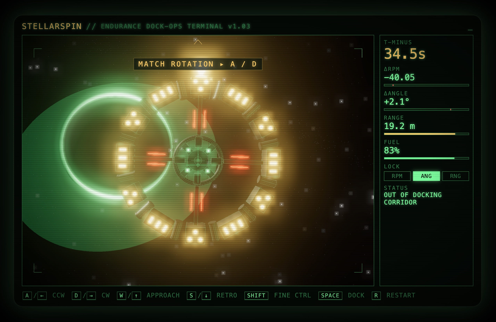

# STELLARSPIN

> _Cooper, what are you doing?_ — **Docking.**

A browser-based docking simulator inspired by the Endurance rendezvous scene from *Interstellar*. Match the ring's rotation, align your docking port, and clamp on — before the timer runs out.



---

## Play

Open `index.html` in any modern Chromium-based browser, or serve the folder:

```sh
python3 -m http.server 9100 --directory .
# then open http://127.0.0.1:9100/
```

> A local server is recommended because the game imports Three.js + postprocessing modules from a CDN; some browsers are stricter about ES module resolution over `file://`.

## Controls

| Key | Action |
| --- | --- |
| `A` / `←` | Fire CCW thruster |
| `D` / `→` | Fire CW thruster |
| `W` / `↑` | Approach thrust (close range) |
| `S` / `↓` | Retro thrust (widen range) |
| `SHIFT` | **Fine control** — 20% torque / 40% linear |
| `SPACE` | Engage docking clamps |
| `R` | Restart |

## How docking works

Three gates must all be green:

| Lock | Tolerance | Meaning |
| --- | --- | --- |
| `RPM` | ±2 RPM | Your rotation rate matches the Endurance's |
| `ANG` | ±8° | Your docking port is aligned with theirs |
| `RNG` | ≤ 10 m | You're inside the docking corridor |

The camera **rolls with your ship**, so when your RPM matches, the Endurance visually locks still while the stars keep streaking past — that's your signal to trim angle and close range.

**Two ways to dock:**
- Tap `SPACE` while all three locks are green
- Or hold all three green for 2.5 s to auto-dock

You have **60 seconds and 100% fuel** before the orbit decays.

### Recommended sequence

1. `HOLD W` until `RANGE` drops below ~45 m
2. `A` / `D` to roughly match the Endurance's RPM — the ring will visually slow
3. `SHIFT + A/D` to trim the last few RPM and sweep angle to zero
4. `SHIFT + opposite` to cancel the fine rate once `ΔANGLE ≈ 0`
5. Last bit of `W` into the corridor
6. `SPACE`

Context-sensitive hints at the top of the viewport tell you the next step if you get lost.

## Features

- **Three.js 3D scene** with a wireframe-to-PBR hull Endurance (12 alternating hab/lander modules, radiator fins, beacons, antennas, a four-winged cockpit hub)
- **UnrealBloomPass** postprocessing for emissive windows, beacons, and the docking port
- **Camera-roll docking visualization** — your spin matches the target's when the ring stops moving on screen
- **Three-layer starfield** (dense small, sparse bloom-bright, distant galaxy band)
- **Custom fresnel-shader planet atmosphere**
- **Procedural soundtrack** — organ pad, arpeggios, and the clock-tick pulse, with a dissonant or resolved swell on fail/success
- **CRT-terminal HUD** (scanlines, vignette, flicker) via CSS overlay

## Tech

- Vanilla ES modules — no build step
- [three.js r161](https://threejs.org/) (loaded from unpkg CDN) + postprocessing addons
- Web Audio API for music and SFX
- Single HTML + CSS + JS file each

## Project layout

```
stellarspin/
├── index.html     # shell, import map, HUD, CRT frame
├── style.css      # CRT aesthetic, HUD layout, hint + overlay styles
├── game.js        # engine, input, physics, scene build, music
└── docs/
    └── screenshot.jpeg
```

## Credits

- Inspired by Hans Zimmer's *No Time For Caution* and the Endurance scene from *Interstellar* (2014). The soundtrack is an original procedural piece in the same emotional register — not a reproduction.
- Built with a lot of help from Claude Code.
